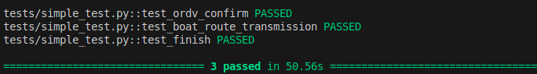

# moreVed


## Disclaimer 

This is a demo project and shall not be used in production.

## Running the demo

There are two main options for running the demo:
- local (using local development environment), then there shall be installed python (tested with version 3.8), also having *make* tool is recommended
- containerized (using docker containers)

### Running complete demo in containerized mode

execute in VS Code terminal window either
- _make run_

then wait about 1 minute. Open the requests.rest file in Visual Studio Code editor. If you have the REST client extension installed, you will see 'Send request' active text above GET ,you can click on it.

If you click on the application GET link, you shall see in the Response window (will open automatically) the following:

```
HTTP/1.1 200 OK
Server: Werkzeug/3.0.6 Python/3.8.20
Date: Mon, 19 May 2025 09:14:00 GMT
Content-Type: application/json
Content-Length: 33
Connection: close

{
  "status": "CKOB started moving"
}
```
 This is expected behavior.

after this message execute
- _make logs_

and see the imitate of boat moving

## Tests
- To run test execute _make test_ or _pytest -sv_ when system is running (expect that required packages were installed)

- Output _make test_ command



#### Troubleshooting
- to run test and _make all_ scenario you need manually install pipenv
