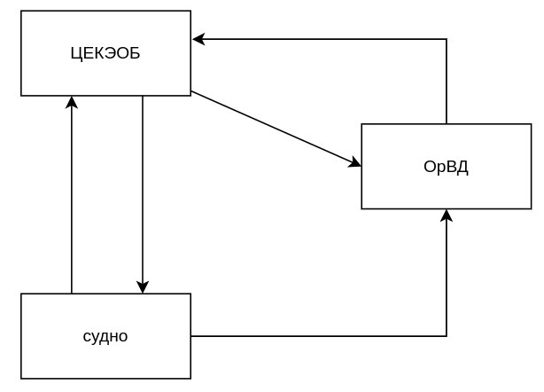
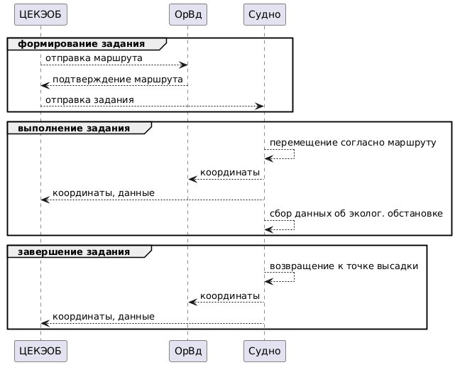
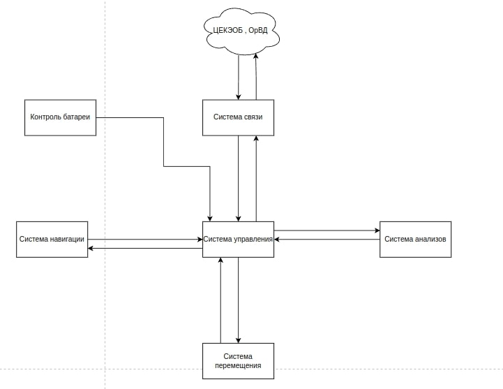
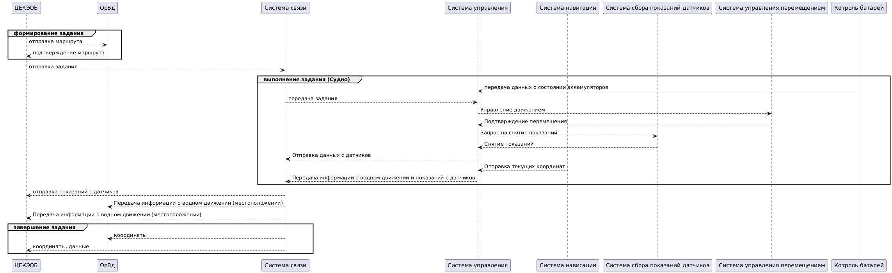
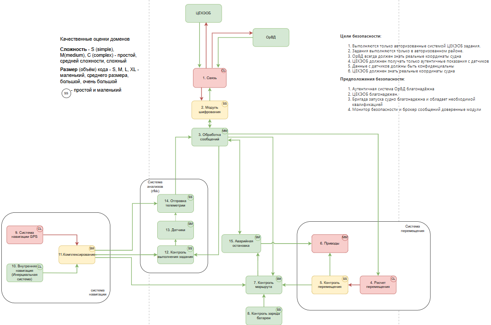
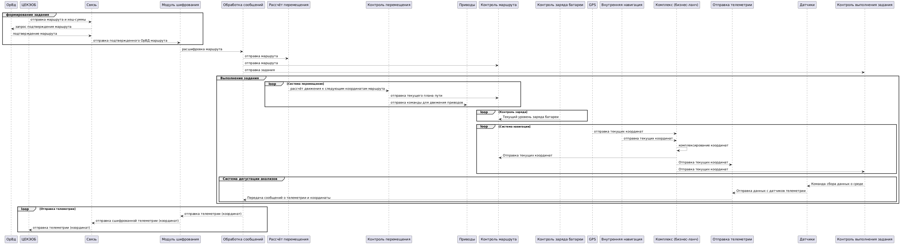
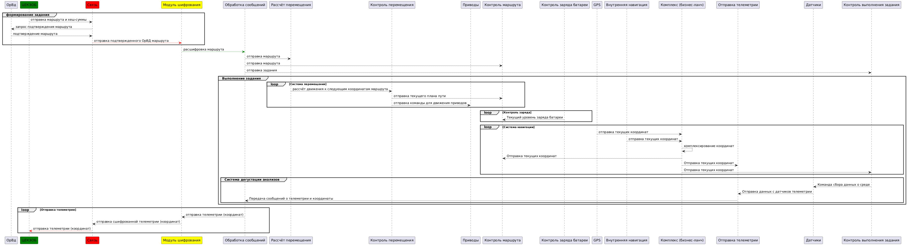
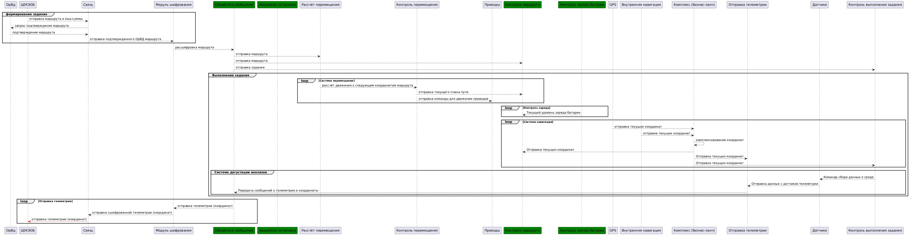
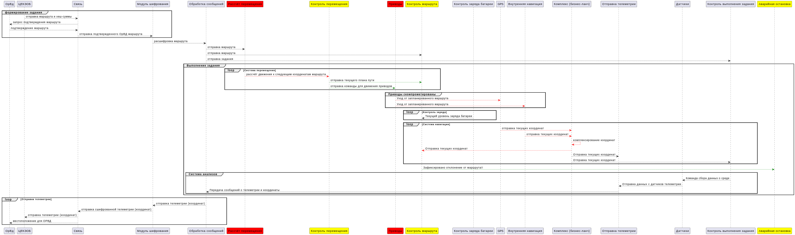
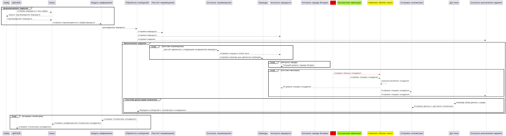

# Отчёт о выполнении задачи "Дрон МореВед"

- [Отчёт о выполнении задачи "Дрон мореВед"](#отчёт-о-выполнении-задачи-name)
  - [Постановка задачи](#постановка-задачи)
  - [Известные ограничения и вводные условия](#известные-ограничения-и-вводные-условия)
    - [Цели и Предположения Безопасности (ЦПБ)](#цели-и-предположения-безопасности-цпб)
  - [Архитектура системы](#архитектура-системы)
    - [Контекст работы системы](#контекст-работы-системы)
    - [Компоненты](#компоненты)
    - [Алгоритм работы решения](#алгоритм-работы-решения)
    - [Описание Сценариев (последовательности выполнения операций), при которых ЦБ нарушаются](#описание-сценариев-последовательности-выполнения-операций-при-которых-цб-нарушаются)
    - [Переработанная архитектура](#переработанная-архитектура)
    - [Указание "доверенных компонент" на архитектурной диаграмме.](#указание-доверенных-компонент-на-архитектурной-диаграмме)
    - [Проверка негативных сценариев](#проверка-негативных-сценариев)
    - [Политики безопасности](#политики-безопасности)
  - [Запуск приложения и тестов](#запуск-приложения-и-тестов)
    - [Запуск приложения](#запуск-приложения)
    - [Запуск тестов](#запуск-тестов)

## Постановка задачи

Центр контроля экологической обстановки (ЦЕКЭОБ) создаёт дрон для мониторинга экологической обстановки водной поверхности, где не всегда есть связь,а также может быть опасно для живых организмов, поэтому нужна функция автономного выполнения задачи.  ЦЕКЭОБ ставит задачу на исследование заданного района, далее к месту проверки выдвигается бригада запуска судна(люди перевозящие судно с места хранения к месту выполнения задачи).
МореВед должен идти в контролируемом водном пространстве, координацию движения в котором осуществляет система организации водного движения (ОрВД). Судно портативное - небольшая лодка которую можно перевозить в наземном транспорте. Далее после запуска судна, контролем заниматся специалист из ЦЕКЭОБ. Во время выполнения задания судно отправляет телеметрию в центр в реальном времени. После исследования, бригада запуска забирает судно и перевозит его к месту храниния

Ценности, ущербы и неприемлемые события

|Ценность|Негативное событие|Оценка ущерба|Комментарий|
|:-:|:-:|:-:|:-:|
|Безэкипажное Судно|В результате атаки потерпел крушение или был угнан|Средний|Безэпижаное судно застраховано|
|Люди|Из-за неверно оцененной обстановки люди могут оказаться в зоне повышенной опасности|Высокий||
|Данные мониторинга|Из-за нарушения целостности данных приняты неправильные решения на стороне центра управления|Средний|Внутренние издержки: Людей не отправили на устранение проблемы. Людей отправили не туда|
|Данные мониторинга|Данные о радиационной обстановке оказались доступны злоумышленикам, что привело к рассекречиванию военных испытаний|Высокий|Нарушение закона о защите секретной информации|
|Инфраструктура|Судно врезалось в объект водной навигации|Высокий||
|Имущество третьих лиц|Судно врезалось в корабль|Высокий|
|Данные мониторинга|Злоумышленник получил данные с судна и распространил их|Высокий|Репутационниые риски|


## Известные ограничения и вводные условия

- По условиям организаторов должна использоваться микросервисная архитектура и брокер сообщений для реализации асинхронной работы сервисов.
- Между собой сервисы cудна общаются через брокер сообщений, а все внешнее взаимодействие происходит в виде REST запросов.
- Графический интерфейс для взаимодействия с пользователем не требуется, достаточно примеров REST запросов.

### Список используемых сокращений
- Организация водного движения (далее ОрВД)
- Центр контроля экологической обстановки (далее ЦЕКЭОБ)
- 

### Цели и Предположения Безопасности (ЦПБ)

Цели безопасности:
1. Выполняются только авторизованные системой ЦЕКЭОБ задания.
2. Задания выполняются только в авторизованном районе.
3. ОрВД получает только аутентичные координаты судна
4. ЦЕКЭОБ должнен получать только аутентичные показания с датчиков
5. Данные с датчиков являются конфиденциальными
6. ЦЕКЭОБ получает аутентичные координаты судна

Предположения безопасности:
1. Аутентичная система ОрВД благонадёжна
2. ЦЕКЭОБ благонадежен.
3. Бригада запуска судна благонадежна и обладает необходимой квалификацией
5. Монитор безопасности и брокер сообщений доверенные модули

## Архитектура системы

### Взаимодействие системы



### Сценарий работы



### Компоненты

Базовая архитектура



Базовая диаграмма последовательности



[Cсылка на исходник диаграммы](https://www.plantuml.com/plantuml/uml/lLPDQjj05DxFAOQi4cWku4K9pRAqNUG4QYg2ePQCB0UoQvosIN31j50AMJYOGdS5LPKIHRQLAxovKJyz3N5dEdQrA5quGffvty-RxmtP6yHU50zxhqKVp-vXj-y5iToYR_IPhkWxJUdZblG6Sl_fYoVIsZDLR-WJPRp-B3psUtuGxuT178MC9eIrVqQ5EbKZocb1YLIdbAe9tLBH48IztZ3e7dfnDmms5vxHFPWJIccEJqiiJZG4Sn-S36A_jn62bbnUq4zAr7igj8Rdtd7tY0Kq6F9l1dvG1IN0kwUAIc3UuWT1T2Sf0_H8dUEbn6BA10T-C0WZ2xoroPecnqVimFEo-Lo_6IVWHh-2qX5gAvgh3nB28OuI1hlZyfTU7FlHYH17KJZiI_MMhIseuA9K-yebMuItHf8G78pTtSTs0cH7rfGFBagO0XmerGL-PpMzi6eOXm4xJKipx4hPymqujTy_OVpWrKg74II72jk1DemmZfbpZk-vqwpSfXdE9SDRjIE4xXYJ6j5hrFD9SGhEGQfHbcgita5I7PwAZxjI4oOh93QK7A85IEPgmelSV65wQaDekpJs6-UrWlXgHOuxaF6StAp29eHLwPHplUxqd266G8T2Org0-OKILeZ6ILJn12wvJy1rpA0m09moPni1B4tET4sDT5a73Q7sFI24VSkubTcuV3EK2Fmb5K1cCCG3y0NeGD56xBKT4jG-JBg-2UjqWhDgSauBEm85gXozSdlbqJHa63DkZMPBM0UWVP7yExFRd5EUL7qzLAlLdJNU_X-_lhsuOJnhwcBDxTMYQnr7hDHudKVtxaU_JG3bVFvx-8F_C7u1)

|Компонент|Назначение|
|:--|:--|
|1. Связь|отвечает за взаимодействие с ЦЕКЭОБ и системой организации водного движения (ОрВД)|
|2. Система анализов|собирает и анализирует данные фото-видеофиксации|
|3. Центральная система управления|осуществляет общее управление судном, контролирует выполнение задания|
|4. Система навигация|предоставляет спутниковые координаты дрона|
|5. Контроль батареи|предоставляет статус остаточного заряда батареи и оценку продолжительности полёта в текущем режиме энергопотребления|
|6. Система перемещения|осуществляет контроль над двигателями и поворотными устройствами|
### Алгоритм работы решения

### Негативные сценарии
|Название сценария|Описание|
|---|----------------------|
|НС-1| При компрометации модуля системы управления в модуль связи (далее в ЦЕКЭОБ и ОрВД) были направлены недостоверные данные о местоположении и показаниях с датчиков (нарушение ЦБ 3,4,6)|
|НС-2| При компрометации модуля системы управления злоумышленник направил в модуль датчиков неверное задание (забор материалов произошел в неправильном месте) (нарушение ЦБ 1)|
|НС-3| При компрометации модуля системы управления злоумышленник направил в модуль перемещения неверное задание на движение (нарушение ЦБ 2)|
|НС-4| При компрометации модуля связи злоумышленник подменил задания для сбора материалов (нарушено ЦБ 1)|
|НС-5| При компрометации модуля связи злоумышленник подменил маршрут (Нарушено ЦБ 2)|
|НС-6| При компрометации модуля связи ОрВд и ЦЕКЭОБ не получил / получил недостоверные координаты судна (Нарушено ЦБ 3,4,6)|
|НС-7| При компрометации модуля связи злоумышленник подменил данные с датчиков (Нарушено ЦБ 4)|
|НС-8| При компрометации модуля связи злоумышленник перехватил данные с датчиков (Нарушено ЦБ 5)|
|НС-9| При компрометации модуля системы анализов злоумышленник подменил данные с датчиков (Нарушено ЦБ 4)|
|НС-10| При компрометации модуля системы анализов злоумышленник получил доступ к данным с датчиков что привело к утечке (Нарушено ЦБ 5)|
|НС-11| При компрометации модуля перемещения злоумышленник помешал выполнению аутентичного маршрута (Нарушено ЦБ 1)|
|НС-12| При компрометации модуля перемещения судно вышло за пределы авторизированного района (Нарушено ЦБ 2)|
|НС-13| При компрометации модуля навигации в систему управления были переданы недостоверная информация о местоположении (Нарушено ЦБ 3,6)|
|НС-14| При компрометации модуля навигации злоумышленник передал в систему управления недостоверное местоположение что привело к забору материала в месте не соответствующем заданию(Нарушено ЦБ 1)|
|НС-15| При компрометации модуля системы управления злоумышленник получил доступ к данным с датчиков (Нарушено ЦБ 5)|

### Описание Сценариев (последовательности выполнения операций), при которых ЦБ нарушаются

Нарушение ЦБ (Целей безопасности) в базовом решении

Напоминание ЦБ:

1. Выполняются только авторизованные системой ЦЕКЭОБ задания.
2. Задания выполняются только в авторизованном районе.
3. ОрВД всегда должен знать реальные координаты судна
4. ЦЕКЭОБ должнен получать только аутентичные показания с датчиков
5. Данные с датчиков должны быть конфиденциальны
6. ЦЕКЭОБ должнен знать реальные координаты судна


|Атакованный компонент|ЦБ1|ЦБ2|ЦБ3|ЦБ4|ЦБ5|ЦБ6|Кол-во нарушений|
|:--|:-:|:-:|:-:|:-:|:-:|:-:|:-:|
|1. Связь|🔴|🔴|🔴|🔴|🔴|🔴|6/6|
|2. Система анализов|🟢|🟢|🟢|🔴|🔴|🟢|2/6|
|3. Центральная система управления|🔴|🔴|🔴|🔴|🔴|🔴|6/6|
|4. Система навигация|🟢|🟢|🔴|🟢|🟢|🔴|2/6|
|5. Система перемещения|🔴|🟢|🔴|🟢|🟢|🔴|3/6|

🟢 - ЦБ не нарушена 🔴 - ЦБ нарушена

**Негативный сценарий - НС-1:**


**Негативный сценарий - НС-2:**


**Негативный сценарий - НС-3:**


**Негативный сценарий - НС-4:**


**Негативный сценарий - НС-5:**


**Негативный сценарий - НС-6:**


**Негативный сценарий - НС-7:**


**Негативный сценарий - НС-8:**


**Негативный сценарий - НС-9:**


**Негативный сценарий - НС-10:**


**Негативный сценарий - НС-11:**


**Негативный сценарий - НС-12:**


**Негативный сценарий - НС-13:**


**Негативный сценарий - НС-14:**


**Негативный сценарий - НС-15:**


## Переработанная архитектура



Описание декомпозиции

Описание декомпозиции

<table>
    <thead>
        <tr>
            <th align="center">Исходный компонент</th>
            <th align="center">Декомпозиция</th>
        </tr>
    </thead>
    <tbody>
        <tr>
            <td rowspan=3 align="center">Система связи</td>
        </tr>
        <tr>
            <td rowspan=1 align="center">Связь</td>
        </tr>
        <tr>
            <td rowspan=1 align="center">Модуль шифрования</td>
        </tr>
        <tr>
            <td rowspan=3 align="center">Система навигации</td>
            <td rowspan=1 align="center">Комплексирование</td>
        </tr>
        <tr>
            <td rowspan=1 align="center">Внутренняя навигация (ИНС)</td>
        </tr>
        <tr>
            <td rowspan=1 align="center">Система навигации GPS</td>
        </tr>
        <tr>
            <td rowspan=3 align="center">Система управления перемещением</td>
            <td rowspan=1 align="center">Приводы</td>
        </tr>
        <tr>
            <td rowspan=1 align="center">Контроль перемещения</td>
        </tr>
        <tr>
            <td rowspan=1 align="center">Расчет перемещения</td>
        </tr>
        <tr>
            <td rowspan=3 align="center">Система сбора показаний датчиков</td>
            <td rowspan=1 align="center">Датчики</td>
        </tr>
        <tr>
            <td rowspan=1 align="center">Отправка телеметрии</td>
        </tr>
        <tr>
            <td rowspan=1 align="center">Контроль выполнения задания</td>
        </tr>
        <tr>
            <td rowspan=4 align="center">Система управления</td>
            <td rowspan=1 align="center">Обработка сообщений</td>
        </tr>
        <tr>
            <td rowspan=1 align="center">Аварийная остановка</td>
        </tr>
        <tr>
            <td rowspan=1 align="center">Контроль маршрута</td>
        </tr>
        <tr>
            <td rowspan=1 align="center">Контроль заряда батареи</td>
        </tr>
    </tbody>
</table>


### Таблица декомпозированной архитектуры

|Компонент|Описание|Комментарий|
|:---|:--|:--|
|1. Модуль связи|Модуль был описан выше||
|2. Модуль шифрования|Расшифрование/шифрование принимаемых/отправляемых пакетов данных.|Работает при помощи SSL протокола. Предполагается, что в ОрВД и Системе ЦЕКЭОБ тоже реализован данный функционал.|
|3. Обработчик сообщений|Распределение задач.|Отправляет параметры маршрута в расчет перемещения, контроль маршрута и контроль выполнения задания. Также занимается передачей сообщений для их последующей отправки с судна|
|4. расчет перемещения|расчет курса. |Рассчитывает необходимые курс и скорость вращения винта для достижения очередной точки маршрута|
|5. Контроль перемещения|Проверка работы модуля расчета перемещения|Вычисляет куда судно придет изпользуя инструкции полученные с модуля расчета перемещения и отправляет примерное положение судна в контроль машрута|
|6. Приводы|Модуль был описан выше||
|7. Контроль маршрута|Проверка правильности выполнения маршрута.|Контролирует выполнение задачи, сверяет текущие координаты с маршрутом, передает команду в модуль аварийной остановки в случае расхождения.|
|8. Контроль заряда батареи|Модуль был описан выше.||
|9. Система навигации GPS|Физический модуль GPS, сообщающий координаты судна.||
|10. Внутренняя навигация|Физический модуль ИНС, сообщающий координаты судна.||
|11. Комплексирование|Комплексирование навигационных данных| Комплексирование навигационных данных, а также отправка текующих навигационных данные в модуль контроля маршрута|
|12. Контроль выполнения задания|Сверяет навигационные данные с маршрутом.|В случае достижения точки сбора данных дает соответствующую команду модулю датчиков.|
|13. Датчики|Сбор данных телеметрии.| При получении команды от модуля контроля выполнения задания собирает данные с датчиков телеметрии.|
|14. Отправка телеметрии|Отправка сообщения с данными о телеметрии в модуль обработки сообщений.||

### Диаграмма последовательности
Общая схема выполнения задания (базовый сцнарий)



## Указание "доверенных компонент" на архитектурной диаграмме


#### Таблица доверенных компонентов

|Компонент|Уровень доверия|Обоснование|Комментарий|
|:--|:--|:--|:--|
|1. Связь|$\textcolor{red}{\textsf{Недоверенный}}$|при компрометации не нарушаются ЦБ||
|2. Модуль шифрования|$\textcolor{orange}{\textsf{Повышающий доверие}}$|при компрометации нарушаются ЦБ 1-6|Дает возможность шифровать сообщения а также подписывать их|
|3. Обработка сообщений|$\textcolor{green}{\textsf{Доверенный}}$|при компрометации нарушаются ЦБ 1-6|передает сообщения с заданием и маршрутом в другие модули|
|4. Расчет перемещения|$\textcolor{red}{\textsf{Недоверенный}}$|При компрометации нсЦБ не нарушены|При компрометации этого модуля данные поступят в модуль контроля перемещения, где будут обработааны и компрометация будет выявлена|
|5. Контроль перемещения|$\textcolor{orange}{\textsf{Повышающий доверие}}$|При компрометации нарушаются ЦБ 1,3,6|Котрольрует команды поступаюзие на привода от модуля расчета|
|6. Приводы|$\textcolor{red}{\textsf{Недоверенный}}$|модуль был описан выше||
|7. Контроль маршрута|$\textcolor{green}{\textsf{Доверенный}}$|При коммпрометации нарушаются ЦБ 1-6|Сверяет данные с систем навигации и данные полученые с модуля контроля перемещения, также принимает решение об аварийной остановке|
|8. Контроль заряда батареи|$\textcolor{green}{\textsf{Доверенный}}$|При компрометации нарушаютсся ЦБ 1-6||
|9. Система навигации GPS|$\textcolor{red}{\textsf{Недоверенный}}$|При компрометации не нарушаются ЦБ||
|10. Внутренняя навигация (Инерциальная система)|$\textcolor{orange}{\textsf{Повышающий доверие}}$|При компрометации нарушаются ЦБ 3,6|||
|11. Комплексирование|$\textcolor{orange}{\textsf{Повышающий доверие}}$|При компрометации нарушаются ЦБ 3,6|Комплексирование GPS + ИНС|
|12. Контроль выполнения задания|$\textcolor{green}{\textsf{Доверенный}}$|При компрометации нарушаются ЦБ 4-5|сверяет текущие координаты с координатами задания и дает команду датчикам для забора анализов|
|13. Датчики|$\textcolor{green}{\textsf{Доверенный}}$|При компрометации нарушается ЦБ 4-5|Анализ окружающей среды|
|14. Отправка телеметрии|$\textcolor{green}{\textsf{Доверенный}}$|При компрометации нарушаются ЦБ 3-6|Собирает показания датчиков и данные о местоположении и подготавливает их к отправке|
|15. Аварийная остановка|$\textcolor{green}{\textsf{Доверенный}}$|При компрометации нарушаются ЦБ 1-2|Выполняет аварийную остановку ко команде модуля контроля маршрута или ОРВД|

#### Качественная оценка доменов

|Компонент|Доверие|Оценка|Кол-во входящих интерфейсов|Комментарий|
|:--|:-:|:-:|:-:|:--|
|1. Связь|$\textcolor{red}{\textsf{Недоверенный}}$|CL|3||
|2. Модуль шифрования |$\textcolor{orange}{\textsf{Повышающий доверие}}$|SS|2||
|3. Обработка сообщений|$\textcolor{green}{\textsf{Доверенный}}$|MM|3||
|4. Расчет перемещения|$\textcolor{red}{\textsf{Недоверенный}}$|CL|1||
|5. Контроль перемещения|$\textcolor{orange}{\textsf{Повышающий доверие}}$|SS|1||
|6. Приводы|$\textcolor{red}{\textsf{Недоверенный}}$|MM|2||
|7. Контроль маршрута|$\textcolor{green}{\textsf{Доверенный}}$|SM|4||
|8. Контроль заряда батареи|$\textcolor{green}{\textsf{Доверенный}}$|SS|0||
|9. Система навигации GPS|$\textcolor{red}{\textsf{Недоверенный}}$|CL|0||
|10. Внутренняя навигация (Инерциальная система)|$\textcolor{orange}{\textsf{Повышающий доверие}}$|CL|0||
|11. Комплексирование|$\textcolor{orange}{\textsf{Повышающий доверие}}$|SM|2|Программный модуль занимающийся комплексированием координат от двух систем навигации|
|12. Контроль выполнения задания|$\textcolor{green}{\textsf{Доверенный}}$|SS|2||
|13. Датчики|$\textcolor{green}{\textsf{Доверенный}}$|SM|1||
|14. Отправка телеметрии|$\textcolor{green}{\textsf{Доверенный}}$|SS|2||
|15. Аварийная остановка|$\textcolor{green}{\textsf{Доверенный}}$|SM|1||

### Проверка негативных сценариев

|Название сценария|Описание|
|---|---------|
|НС-1|Тест Негативного сценария 1, 4, 5, 6, 7, 8. Модуль связи скомпрометирован и пытается изменить данные, что приводит к измению пакета из за чего Блок шифрования данных не может его расшифровать, ЦБ не нарушены|
|НС-2|Тест Негативного сценария 2, 3, 9, 10, 15. Злоумышленник попытался взломать доверенный модуль, ЦБ не нарущены|
|НС-3|Тест Негативного сценария 11, 12. Злоумышленник взламывает модуль "Расчет перемещения"/"приводы", но модуль "Контроль маршрута" фиксирует отклонение от маршрута и судно совершает аварийную остановку, ЦБ не нарушены|
|НС-4|Тест Негативного сценария 13, 14. Злоумышленник скомпрометировал модуль "Система навигации GPS", но модуль "Комплексирования" сравнил результаты с данными модуля "Внутренняя навигация (Инерциальная система)" и выявил взлом, ЦБ не нарушены|

НС-1



НС-2



НС-3



НС-4



|Компонент|Соответствие|
|-----|-----|
|1. Связь|communication|
|2. Модуль шифрования|crypto|
|3. Обработка сообщений|message-processing|
|4. Расчет перемещения |movement-calculation|
|5. Контроль перемещения |movement-control|
|6. Приводы|servo|
|7. Контроль маршрута|route-control|
|8. Контроль заряда батареи|battery-charge-control|
|9. ГНСС навигация|gnss-navigation|
|10. Инерциальная система навигации|internal-navigation|
|11. Приводы|complex|
|12. Контроль выполнения задания|task-execution-control|
|13. Датчики|sensors|
|14. telemetry-transmission|
|15. Аварийная остановка|emergency-stop|
|ОрВД|ordv|
|ЦEКОЭБ|ckob|

### Политики безопасности

```python {lineNo:true}
policies = (
    {"src": "communication", "dst": "crypto", "opr": "set_route"},
    {"src": "communication", "dst": "crypto", "opr": "emergency_stop"},
    {"src": "crypto", "dst": "message-processing", "opr": "set_route"},
    {"src": "crypto", "dst": "communication", "opr": "send_telemetry"},
    {"src": "crypto", "dst": "message-processing", "opr": "emergency_stop"},
    {"src": "crypto", "dst": "communication", "opr": "emergency_stop"},
    {"src": "message-processing", "dst": "movement-calculation", "opr": "set_route"},
    {"src": "message-processing", "dst": "route-control", "opr": "set_route"},
    {"src": "message-processing", "dst": "task-execution-control", "opr": "set_task"},
    {"src": "message-processing", "dst": "crypto", "opr": "send_telemetry"},
    {"src": "message-processing", "dst": "emergency-stop", "opr": "emergency_stop"},
    {"src": "message-processing", "dst": "crypto", "opr": "emergency_stop"},
    {"src": "telemetry-transmission", "dst": "message-processing", "opr": "send_telemetry"},
    {"src": "sensors", "dst": "telemetry-transmission", "opr": "send_sensors_data"},
    {"src": "task-execution-control", "dst": "sensors", "opr": "get_sample"},
    {"src": "complex", "dst": "route-control", "opr": "set_coords"},
    {"src": "complex", "dst": "task-execution-control", "opr": "set_coords"},
    {"src": "complex", "dst": "telemetry-transmission", "opr": "set_coords"},
    {"src": "gnss-navigation", "dst": "complex", "opr": "set_gnss_coords"},
    {"src": "internal-navigation", "dst": "complex", "opr": "set_internal_coords"},
    {"src": "internal-navigation", "dst": "complex", "opr": "set_internal_coords"},
    {"src": "battery-charge-control", "dst": "route-control", "opr": "set_battery"},
    {"src": "route-control", "dst": "emergency-stop", "opr": "emergency_stop"},
    {"src": "route-control", "dst": "emergency-stop", "opr": "emergency_stop"},
    {"src": "emergency-stop", "dst": "servo", "opr": "emergency_stop"},
    {"src": "emergency-stop", "dst": "message-processing", "opr": "emergency_stop"},
    {"src": "emergency-stop", "dst": "message-processing", "opr": "emergency_stop"},
    {"src": "movement-control", "dst": "servo", "opr": "move_to"},
    {"src": "movement-control", "dst": "route-control", "opr": "move_to"},
    {"src": "movement-calculation", "dst": "movement-control", "opr": "move_to"},
    {"src": "route-control" , "dst": "message-processing", "opr": "route_complete"},
    {"src": "message-processing" , "dst": "crypto", "opr": "route_complete"},
    {"src": "crypto" , "dst": "communication", "opr": "route_complete"}
)

def check_operation(id, details) -> bool:
    """ Проверка возможности совершения обращения. """
    src: str = details.get("source")
    dst: str = details.get("deliver_to")
    opr: str = details.get("operation")

    if not all((src, dst, opr)):
        return False

    print(f"[info] checking policies for event {id},  {src}->{dst}: {opr}")

    return {"src": src, "dst": dst, "opr": opr} in policies
```

## Запуск приложения и тестов

### Запуск приложения

см. [инструкцию по запуску](README.md)

### Запуск тестов

_Предполагается, что в ходе подготовки рабочего места все системные пакеты были установлены._

Запуск примера: открыть окно терминала в Visual Studio code, в папке с исходным кодом выполнить

**make all**

Запуск всего проекта вместе с тестами, (предполагается что все необходимые пакеты установлены)

**make test**
Запуск тестов (при условии что система запущена)
